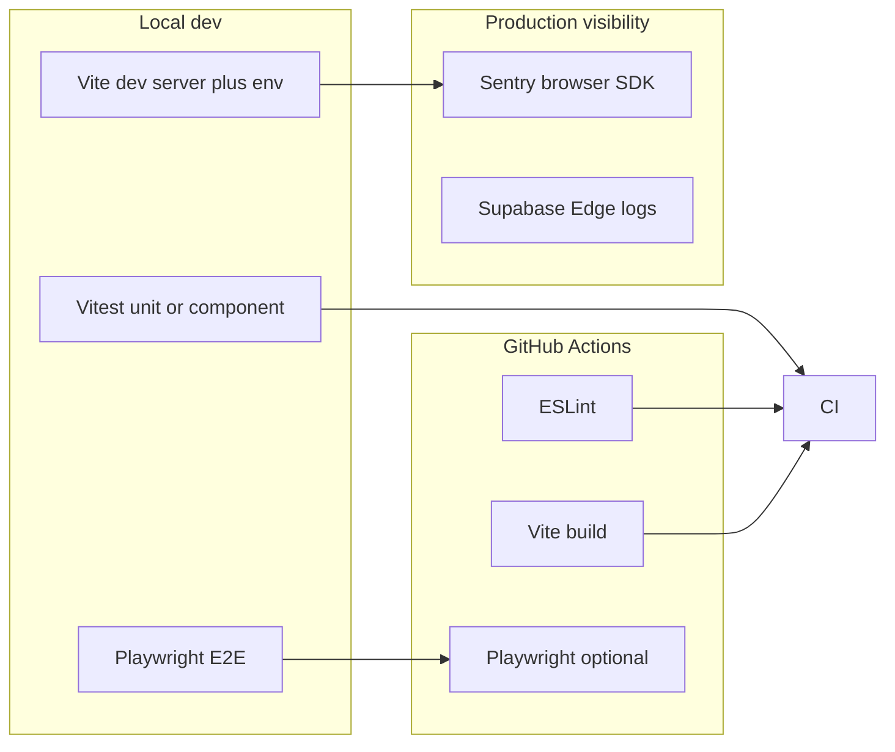

# Testing architecture and commands

How automated tests, observability, and CI fit together. **Pending testing work and manual QA checklists** live in [`PLATFORM_TODOS.md`](PLATFORM_TODOS.md) under **Testing**.

---

## 1. Overview



| Layer | Role | Where |
|-------|------|--------|
| **Vitest** | Fast feedback on hooks, repositories, utils, components | `src/**/*.test.{ts,tsx}` |
| **Playwright** | Smoke paths with real browser + hosted Supabase | `tests/e2e/` |
| **Lint + build** | Type/env issues before merge | `npm run smoke` |
| **Sentry** | Client exceptions and `captureApiError` API failures | [`src/infrastructure/sentry.ts`](../src/infrastructure/sentry.ts), [`ErrorBoundary`](../src/components/ErrorBoundary.tsx) |
| **Supabase** | Edge function logs, Postgres, Auth dashboard | Supabase project dashboard |

---

## 2. Commands

| Command | Purpose |
|---------|---------|
| `npm run test` | Full Vitest suite (once) |
| `npm run test:watch` | Vitest watch mode |
| `npm run build` | Production bundle (validates env consumers at compile time) |
| `npm run smoke` | `npm run test` then `npm run build` |
| `npm run lint` | ESLint (warnings are allowed today; zero errors required) |
| `npm run test:e2e` | Playwright (starts dev server per `playwright.config.ts`) |
| `npm run test:e2e:ui` | Playwright with UI |

**Before a PR:** `npm run smoke`.

**Before a release:** add `npm run test:e2e` when secrets and seed data are available (see [E2E](#5-end-to-end-playwright)).

**Phone OTP helpers (Vitest):** [`src/utils/phoneLocalIdentity.test.ts`](../src/utils/phoneLocalIdentity.test.ts) covers `phoneLocalIdentityVariants` / `redactEmailForLog` used by [`verify-otp`](../supabase/functions/verify-otp/index.ts) via [`supabase/functions/_shared/phone-local-identity.ts`](../supabase/functions/_shared/phone-local-identity.ts). Staging smoke: complete SMS OTP on a real project after deploying `verify-otp` and confirm Edge logs show **`OTP login successful`** or a **`sessionDiag`** block on failure.

---

## 3. Sentry (browser)

**Implementation**

- **`initBrowserSentry()`** runs once at startup from [`src/main.tsx`](../src/main.tsx) before React renders.
- If **`VITE_SENTRY_DSN`** is unset or empty, Sentry is **not** initialized (no overhead, no outbound calls).
- When set, [`src/infrastructure/sentry.ts`](../src/infrastructure/sentry.ts) configures the React SDK with `sendDefaultPii: false` and `tracesSampleRate: 0` (errors only, no performance tracing by default).
- **Reports go to Sentry when:**
  - [`ErrorBoundary`](../src/components/ErrorBoundary.tsx) catches a render error (`captureClientException`).
  - [`captureApiError`](../src/infrastructure/errorCapture.ts) runs after [`createLogger`](../src/infrastructure/logger.ts) logs an API error (edge function failures surfaced to the client).

**Local / staging setup**

1. Create a project in [Sentry](https://sentry.io) (browser / React).
2. Copy the **DSN** into **`.env.local`** (gitignored):

   ```bash
   VITE_SENTRY_DSN=https://xxxx@xxxx.ingest.sentry.io/xxxx
   ```

3. Restart `npm run dev`. Trigger an error (e.g. throw in a dev-only branch) and confirm the event in Sentry **Issues**.

4. Optional: set **`VITE_SENTRY_SUPPRESS_LOCALHOST=1`** in `.env.local` to **stop** sending events from `localhost` / `127.0.0.1` (e.g. reduce noise from Playwright). By default, loopback traffic **does** report when `VITE_SENTRY_DSN` is set.

**CI / production builds**

- Add **`VITE_SENTRY_DSN`** as an optional GitHub Actions **secret** so `vite build` in CI embeds the DSN in the bundle when you want release tracking from deployed artifacts. Same variable for hosting (Vercel, etc.).

**Security note:** The DSN is embedded in client JS; it is not a server secret. Restrict data in events via Sentry project settings and scrubbing if needed.

---

## 4. CI (GitHub Actions)

Workflow: [`.github/workflows/ci.yml`](../.github/workflows/ci.yml).

1. **Job `ci`:** checkout → `npm ci` → ESLint → Vitest → `vite build` (passes through `VITE_STRIPE_PUBLISHABLE_KEY`, **`VITE_SENTRY_DSN`** when the secret exists).
2. **Job `e2e`:** runs after `ci` succeeds; installs Chromium; runs `npm run test:e2e` **only if** `VITE_SUPABASE_URL` and `VITE_SUPABASE_PUBLISHABLE_KEY` repository secrets are set. Otherwise the step exits 0 and prints a notice.

**Repository secrets (typical)**

| Secret | Used for |
|--------|----------|
| `VITE_SUPABASE_URL`, `VITE_SUPABASE_PUBLISHABLE_KEY` | E2E dev server + app |
| `VITE_SUPABASE_PROJECT_ID` | Optional for E2E |
| `VITE_STRIPE_PUBLISHABLE_KEY` | Build + checkout E2E (non-placeholder) |
| `VITE_SENTRY_DSN` | Optional; Sentry in CI-built bundle |
| `SUPABASE_EXPECTED_PROJECT_ID` | Optional guard script vs `supabase/config.toml` |

---

## 5. End-to-end (Playwright)

- **Config:** [`playwright.config.ts`](../playwright.config.ts) — `baseURL` `http://127.0.0.1:4173`, `webServer` runs `npm run dev`.
- **Auth fixture:** [`tests/e2e/auth.setup.ts`](../tests/e2e/auth.setup.ts) uses **dev-login** and saves `tests/.auth/user.json` for authenticated specs.
- **Host RSVP smoke:** [`tests/e2e/send-rsvp.spec.ts`](../tests/e2e/send-rsvp.spec.ts) loads `/events/:id/send-rsvp` (heading + search field) using a seeded event link from home — does not exercise Edge `profile-search-host` / `rsvp-bulk-invite`.
- **Requires:** `dev-login` deployed; **`SEED_USER_PASSWORD`** Edge secret (e.g. `seedplaceholder1`); [`auth_users_seed.sql` + `data_export.sql`](supabase/AUTH_AND_SEEDING.md) on the **same** project as `VITE_SUPABASE_URL` so Dylan has a profile phone.

**Invalid JWT on edge calls:** same `VITE_SUPABASE_*` project as deployed functions; sign out and sign in after switching projects. See [PAYMENT_FLOW.md — Troubleshooting](PAYMENT_FLOW.md#troubleshooting-401--invalid-jwt).

---

## 6. Writing tests

**Unit / component (Vitest)**

- Colocate: `foo.ts` → `foo.test.ts`.
- Mock Supabase chains and `callEdgeFunction` where needed; see existing tests under `src/features/**`, `src/hooks/**`.
- Host RSVP helpers / UI: [`src/utils/hostRsvpInvite.test.ts`](../src/utils/hostRsvpInvite.test.ts), [`src/pages/SendRsvp.test.tsx`](../src/pages/SendRsvp.test.tsx).

**E2E**

- Add specs under `tests/e2e/`; depend on `auth.setup` when authenticated state is required.

**Performance of production DB**

- Use [Plans/SUPABASE_DISK_IO_AND_PERFORMANCE_REMEDIATION_PLAN.md](Plans/SUPABASE_DISK_IO_AND_PERFORMANCE_REMEDIATION_PLAN.md) (`pg_stat_statements`) before tuning Postgres.

---

## 7. Troubleshooting

| Issue | What to check |
|-------|----------------|
| `npm run test` fails | Fix failing tests or restore mocks; run `npm run smoke`. |
| E2E times out | Dev server URL/port in `playwright.config.ts`; network to Supabase. |
| E2E setup: `dev-login` **404** | Function not deployed, or `SEED_USER_PASSWORD` / profile phone missing — [AUTH_AND_SEEDING.md](supabase/AUTH_AND_SEEDING.md). |
| E2E skipped in CI | Add `VITE_SUPABASE_URL` and `VITE_SUPABASE_PUBLISHABLE_KEY` repo secrets. |
| No Sentry events | `VITE_SENTRY_DSN` unset after restart; or error not reaching `ErrorBoundary` / `captureApiError`. |
| `vi.mock` not applied | Hoist mocks; use `vi.mock` at top of file. |

---

## 8. Related docs

- [`PAYMENT_TICKETING_PROGRAM.md`](PAYMENT_TICKETING_PROGRAM.md) — Phased payment/ticketing QA (buyer vs organiser), test-mode keys.
- [`PLATFORM_TODOS.md`](PLATFORM_TODOS.md) — Testing backlog, manual UAT matrix, optional E2E hardening.
- [`docs/supabase/README.md`](supabase/README.md) — Supabase ops hub.
- [`docs/supabase/CLOUD_TASKS.md`](supabase/CLOUD_TASKS.md) — Message queue (GCP Cloud Tasks) and **why the queue can be empty**.
- [`docs/PAYMENT_FLOW.md`](PAYMENT_FLOW.md) — Stripe sandbox and webhooks.

---

## 9. Stripe checkout E2E and CI

- **`tests/e2e/checkout.spec.ts`** skips the checkout assertion path unless `VITE_STRIPE_PUBLISHABLE_KEY` is set and not `pk_test_placeholder`. That keeps default CI green when Stripe is not configured.
- **`tests/e2e/send-rsvp.spec.ts`** runs in the authenticated project (depends on `auth.setup`); only asserts the Send RSVP page shell.
- **Full** checkout E2E (embedded Stripe, success redirect) needs a **non-placeholder** `pk_test_` key in the environment, a deployed project with `orders-reserve` / `payments-intent` / `stripe-webhook`, and usually seeded events with paid tiers. Treat that as **staging** or optional GitHub Actions secrets (`VITE_STRIPE_PUBLISHABLE_KEY`), not a blocker for unit + lint + build jobs.
- **Organiser-side** E2E (Connect onboarding, Manage Event orders) requires additional fixtures (organiser profile, event ownership); prefer manual Phase C in [`PAYMENT_TICKETING_PROGRAM.md`](PAYMENT_TICKETING_PROGRAM.md) until seed data and secrets are stable.
- Webhook-driven behavior is still best verified with [Stripe CLI](https://stripe.com/docs/stripe-cli) `listen --forward-to` or Dashboard **Send test webhook** plus the [manual playbook](PAYMENT_FLOW.md#manual-qa-playbook-sandbox).
